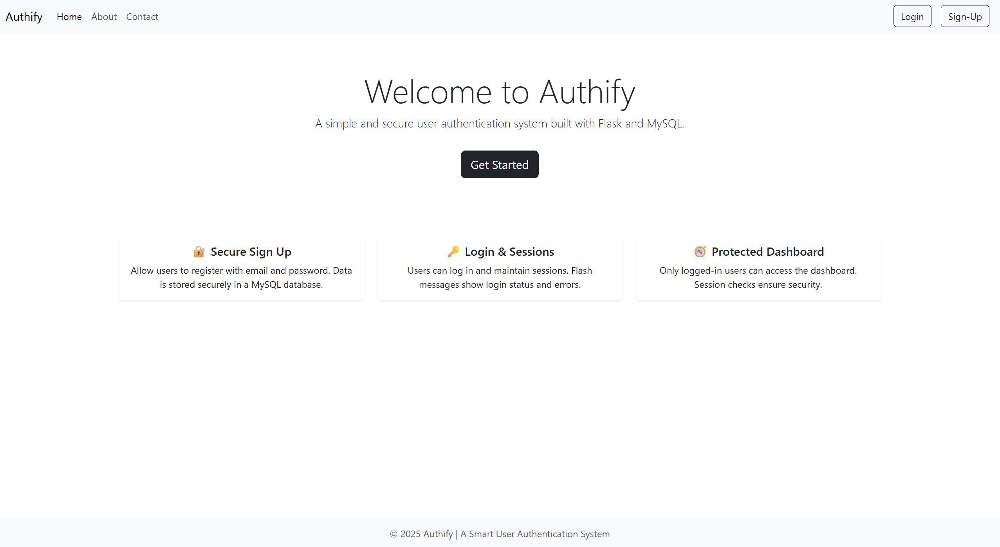
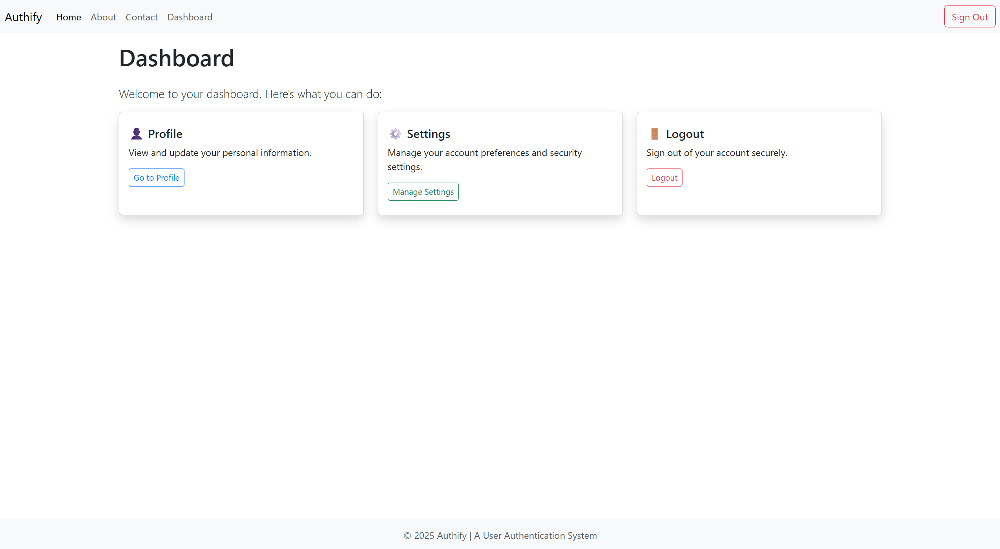

# 🔐 Authify - User Authentication System

Authify is a simple and secure user authentication web application built using **Flask**, **MySQL**, and **Bootstrap 5**.  
It allows users to sign up, log in, and access a protected dashboard with session-based authentication.

---

## 🚀 Features

- ✅ User Registration with form validation  
- ✅ Secure Login with email and password  
- ✅ Protected dashboard accessible only after login  
- ✅ Clean, responsive UI using Bootstrap 5  
- ✅ Custom 404 error page  

---

## 📷 Screenshots

- **Home Page :**  



- **Dashboard :**



- **404 Page :**  


---

## 🧰 Tech Stack

- **Frontend:** HTML, Bootstrap 5  
- **Backend:** Python, Flask  
- **Database:** MySQL  
- **ORM/Connector:** Flask-MySQLdb  
- **Templating:** Jinja2  

---

## ⚙️ Setup Instructions

### 1. Clone the Repository :

```bash
git clone https://github.com/PranavNikam-15/authify-user-authentication.git
cd authify
```

### 2. Install Dependencies :

```
pip install -r requirements.txt
```

### 3. Configure MySQL Database :
- Start MySQL server and execute :
```
CREATE DATABASE flask_auth;
USE flask_auth;

CREATE TABLE users (
    id INT AUTO_INCREMENT PRIMARY KEY,
    username VARCHAR(100) NOT NULL,
    email VARCHAR(100) NOT NULL UNIQUE,
    password VARCHAR(255) NOT NULL
);
```

### 4. Setup .env File :
- Create a .env file in the root directory of your project and add :

```
MYSQL_HOST=localhost
MYSQL_USER=root
MYSQL_PASSWORD=your_password
MYSQL_DB=flask_auth
```

### 5. Run the App :

```
python run.py
```

Open your browser and visit:
<br> http://127.0.0.1:5000